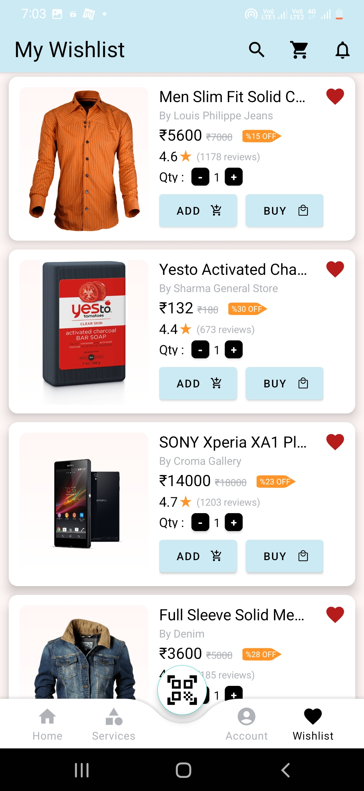

# E-Commerce

## What you should know
-Android basics (project structure, how to make hello world! app )

-Java Basics

## Features
-login, register and forget password

-user profile, Order History

-shopping cart

-edit profile

-home page products and categories

-view product(slide for more images)

-view product details

-add to cart

-filters

-search

-categories home page

-my addresses

-wishlist

## Techniques
RecycleView, ToolBar, CardView, ListView, NestedScroll, DrawerLayout, ActionBarDrawerToggle, NavigationView, ProgressBar, DialogFragment, Fragments and more.

## Developed By
* Author : Aman Pandey
* Email  : amanpandey12398@gmail.com

Here are some screenshots of app

For further clarfications or doubts you can connect with me at amanpandey12398@gmail.com 
